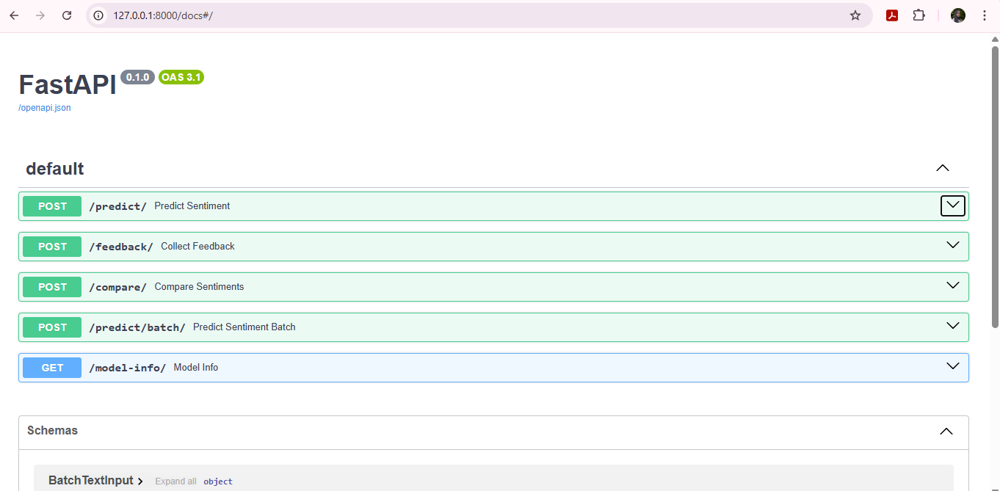

# Sentiment Analysis API

This is a FastAPI-based service that uses a Hugging Face transformer model to analyze the sentiment of text inputs. The API supports individual predictions, batch predictions, comparisons, feedback submission, and versioning information.

---

## Features

- Predict sentiment of a single text (`/predict/`)
- Analyze multiple texts (`/predict/batch/`)
- Compare two texts (`/compare/`)
- Submit feedback on predictions (`/feedback/`)
- View model metadata (`/model-info/`)

Each feature was developed in its own Git branch, reviewed, and merged via pull requests for collaborative development.



---

## Setup Instructions

### 1. Clone the Repository

```bash
git clone https://github.com/alaa3oun/sentiment-analysis-api.git
cd sentiment-analysis-api
